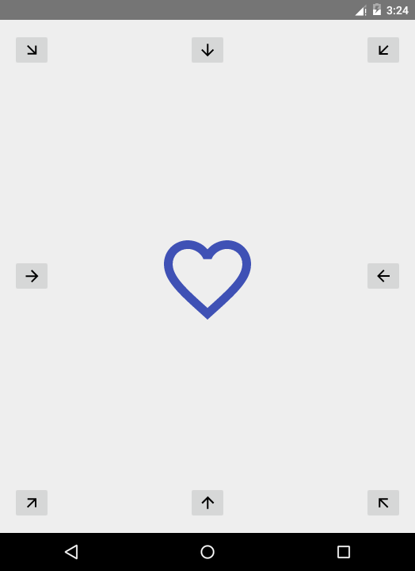

# hearty

Which way to change my heart's content? :wink: :heart:

## Introduction :point_up:

In this here repository is repositoried an Android app that shows how Android [vectors] can be used to illustrate filling and emptying. The material from which this app was made is covered in an online class by [Udacity](https://www.udacity.com/) called [Material Design for Android Developers](https://www.udacity.com/course/material-design-for-android-developers--ud862). The original source code is contained [here](https://github.com/udacity/ud862-samples) on GitHub in the [HeartFill](https://github.com/udacity/ud862-samples/tree/master/HeartFill) folder.

## Version History :package:

**latest** 	[Hearty v1.0.0](https://github.com/joshua-kairu/xml-test/releases/download/v1.0/hearty-v1.0.0.apk) 	Thursday, July 21, 2016

This repo tries its best to follow the [Semantic Versioning](http://semver.org/) guidelines.

## How To Use :wrench:

:zero: Put the app in your phone.

:one: You will see an empty blue heart surrounded by eight arrows. It will look like this:

 

:two: Tapping on any of the arrows when the heart is empty will fill the heart with blue goodness from the corner of the screen that the button is positioned.

:three: Tapping on any of the arrows when the heart is to the brim with blueness will empty the heart to the direction of the screen where the tapped button is.

## How It Works

[clip-path]s are what have been used here to animate the filling and emptying of the heart. 

* When **filling** we start with an empty heart and place a hidden clip path at a particular point in the heart. We then enlarge the clipped area to fill the whole heart with a blue color. Then finally we put a full blue heart in place of the empty one. All this is done fast enough to result in an animation that looks like a heart fill.

* When **emptying** we start with a heart full of color blue and place a hidden clip path at a particular point in the heart. We also create a clip area that initially covers the whole of the heart and that has a blue color. Then we shrink that clip path to the hidden clip path and replace the full blue heart with the empty one. Speed tricks the eye to believe an empty has happened. The table below shows the clip path configurations for each of the arrows in the screen. 

Arrow | Hidden Clip Path | Full Clip Path
---- | -----|----
Top left | Three points at top left of heart | A right angled triangle covering the whole heart whose 90 degrees is at top left of heart
Top | Four points forming a line at top of heart | A square covering the whole heart
Top right | Three points at top right of heart | A right angled triangle covering the whole heart whose 90 degrees is at top right of heart
Right | Four points forming a line at right of heart | A square covering the whole heart
Bottom right | Three points at bottom right of heart | A right angled triangle covering the whole heart whose 90 degrees is at bottom right of heart
Bottom | Four points forming a line at bottom of heart | A square covering the whole heart
Bottom left | Three points at bottom left of heart | A right angled triangle covering the whole heart whose 90 degrees is at bottom left of heart
Left | Four points forming a line at left of heart | A square covering the whole heart

Something of note is that we had to create each of these animations almost from scratch since a single vector image seems to only allow one clip path. So each direction had to have its own vector file - eight vector files in total. And each animation needed its own animated vector file - 16 animated vector files in total. Not easy. :grin:

## Abilities :muscle:

This app shows how to:

* Animate the filling of a vector shape
* Animate the emptying of a vector shape

## Limitations :worried:

This app is limited by the following:

* It works only for Android Lollipop and above - clipping is not supported on older versions
* The arrows on the buttons do not animate when tapped

## Possible Future Work :fast_forward:

As of Thursday, July 21, 2016, some future work might include: 
- [ ] Animate all the buttons when each of them is tapped so as to show whether we are filling or emptying

## Other things :books:

Thumbs up :+1: to:
* Udacity for the class. I'm done. It's been enlightening.
* Jake Wharton for [Butter Knife](http://jakewharton.github.io/butterknife/), a library for binding fields to views in Android. This was used to bind the buttons and the heart shape.

The wait for a Lollipop device continues. :clock1:

## License :lock_with_ink_pen:

This repository is licensed under the [GNU General Public License Version 3](http://www.gnu.org/licenses/gpl-3.0.en.html).
